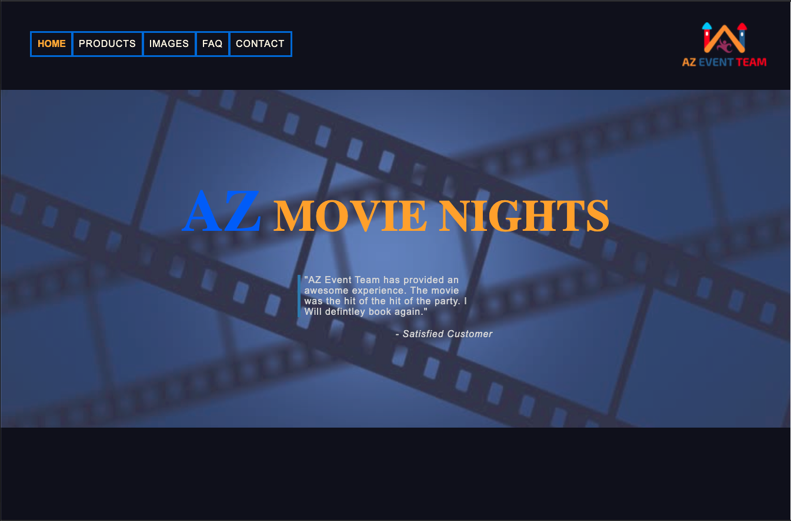

# **AZ Movies Nights**

###### By Trevor Mackin 03/01/2020  

<!--  -->

## **Description**

_This is a client-side application built in React. This project focuses on building a website for an outdoor movie theatre rental company._

_The business has a small number of products that a user can choose from by clicking on an item. Once the user chooses a product, a single page will be populated with all the corresponding data from that particular product. From here, a user will be able to add this product to a wish list, view the entirety of their wishlist at this point, move on to the checkout page, or return back to the list of products._

_When a user has decided that they have saved all relevant products in the wish list, a user will then head to checkout where they will see their wish list, and be asked to fill out a form. The form will include personal information, the day and time of the event, and any other information they wish to add at this time. This information will then be used to populate an email response to the business owner, and then be sent along with the customers wish list._ 

_The reason for the unorthodox checkout, and the reason for a wish list instead of a cart, is due to the nature of the company. It is my understanding that the company prefers to first speak with customers due to the many factors that go into planning an event. This site will eventually function as the main page for an event team, and they have requested that the site follow this model._ 
#

##  **Setup/Installation Instructions**

1. Github Project Address: https://github.com/ratta2ii/az-movie-nights
2. $ git clone https://github.com/ratta2ii/az-movie-nights.git (Clone repository)
3. $ cd az-movie-nights (Navigate to the project directory) 
4. $ npm install
5. $ npm run start
#

## **Features**

* Email response once a user has submitted their wishlist
* Stateful components using Redux
* CRUD functionality for the user to add and remove items from the wishlist
* Fully responsive down to 300px width
* Collapsable navbar for smaller screens
* Sidebar activated when a user selects the hamburger icon
#
   
## **Component Tree (Planning Phase)**

### **Technologies Used**

* React
* JavaScript
* Html
* Css
* Redux
* Webpack

# **Rough Draft Proposal** (Note: Not a business proposal)

##### AZ Movie Nights

This site will function as main webpage for a small business owner who runs an outdoor movie theatre rental company. The site will provide a list of products, and a way for a user to reserve the products for their next outdoor event.

##### **The minimum features for this project are:**

* Homepage with navbar, description of the company, and all products visible for a user to purchase.
* FAQ page.
* Single modal that will render different data depending on the product selected.
* Cart or wish list to capture the products that a user orders.
* Checkout page that will display the order, the total price of the order.
* Form to collect personal information, and the date and time of the event. 

##### **Languages, tools, frameworks, API’s:**

* React
* Javascript
* CSS
* HTML
* Redux
* Firebase

##### **Beyond MVP:**

* Storing data for products in FireBase
* Billing through PayPal linked to checkout
* Weather API. The site caters to outdoor events so I thought this would be a good feature
* Admin section for the owner to view recent orders

##### **Additional resources:**

* PayPal API
* Weather API
* Firebase

## **License**

Copyright (c) 2019 **MIT**